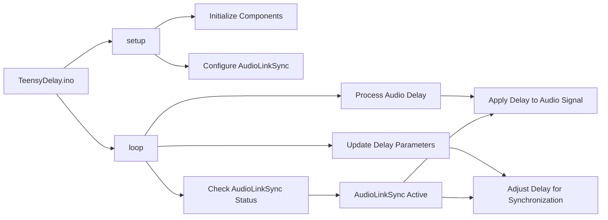

# daily
something to record
# 2024-05-05
- [ ] 早起
- [ ] 早睡
- [ ] 读书
- [ ] 写作
- [ ] 锻炼
- [ ] 代码
- [ ] 工作
- [ ] 休息
- [ ] 旅行
- [ ] 交友
- [ ] 亲情
- [ ] 爱情

# mermaid source

```mermaid
graph LR
    A[TeensyDelay.ino] --> B[setup]
    A --> C[loop]
    B --> D[Initialize Components]
    B --> E[Configure AudioLinkSync]
    C --> F[Check AudioLinkSync Status]
    C --> G[Process Audio Delay]
    C --> H[Update Delay Parameters]
    F --> I[AudioLinkSync Active]
    G --> J[Apply Delay to Audio Signal]
    H --> K[Adjust Delay for Synchronization]
    I --> J
    I --> K
```

